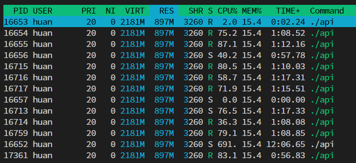
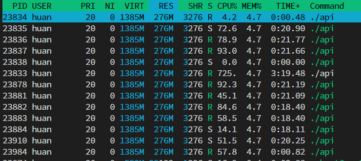
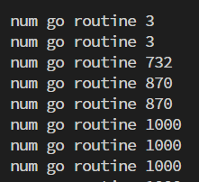
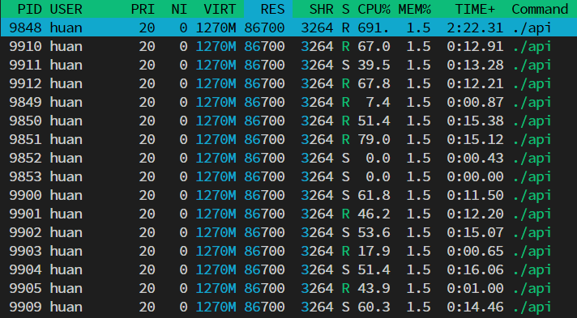

# Golang toy server performance

How to reduce the memory usage from 897MB to 87MB while maintaining the same performance.

## Context 
this is a toy api server as performance comparsion between Go and Rust demonstrated in https://www.youtube.com/watch?v=MY3Ou5ehwUQ&ab_channel=VagelisProkopiou.

Came across the video and found the number very interesting.

As someone who knows a bit about Go but knows nothing about Rust, I was quite suprised about how much the memory usage difference.
So I wanted to take a closer look.

## Original

Now I have cloned the project and build the project as below:

```
$ go version
go version go1.18.3 linux/amd64

$ go build -o api .

$ ./api

 ┌───────────────────────────────────────────────────┐ 
 │                   Fiber v2.23.0                   │ 
 │               http://127.0.0.1:3000               │ 
 │       (bound on host 0.0.0.0 and port 3000)       │ 
 │                                                   │ 
 │ Handlers ............. 2  Processes ........... 1 │ 
 │ Prefork ....... Disabled  PID ............. 19578 │ 
 └───────────────────────────────────────────────────┘ 
```

I started `wrk` similar to how it's done in the video:

```
$ wrk -t6 -c1000 -d60s http://localhost:3000/api/v1/users
Running 1m test @ http://localhost:3000/api/v1/users
  6 threads and 1000 connections
  Thread Stats   Avg      Stdev     Max   +/- Stdev
    Latency   104.05ms  104.54ms   1.31s    86.98%
    Req/Sec     2.01k   397.97     4.93k    72.67%
  719292 requests in 1.00m, 71.53GB read
Requests/sec:  11965.50
Transfer/sec:      1.19GB
```

During the mean time this is the memory usage I observed with `htop`:



897MB, even more than the usage shown in the video. I assume the difference is mainly because of the go version.
But the point still stands: Tho the RPS is very good, the memory usage is **high**.

## Array to slice

Reading through the code one thing quickly stands out:

```
[1000]User
```

This is an `array` in Golang, not actually something I come across very frequently, more often I use `slice`.

One can easily find a million articles about the difference between `array` and `slice`, but whats important here is:

> Array is passed by vaule whereas Slice is passed by reference (1.)

So lets change that:

```diff
-func getUsers() [1000]User {
+func getUsers() []User {
...
-return users
+return users[:] // https://go.dev/ref/spec#Slice_expressions
```

Now this is the result again:

```
wrk -t6 -c1000 -d60s http://localhost:3000/api/v1/users
Running 1m test @ http://localhost:3000/api/v1/users
  6 threads and 1000 connections
  Thread Stats   Avg      Stdev     Max   +/- Stdev
    Latency   154.04ms  187.97ms   1.97s    84.13%
    Req/Sec     1.93k   552.97     4.32k    69.61%
  690719 requests in 1.00m, 68.69GB read
  Socket errors: connect 0, read 0, write 0, timeout 1
Requests/sec:  11493.62
Transfer/sec:      1.14GB
```



Basically the same RPS (the difference is most likely errors), but now the memroy usage dropped from `897MB` to `276MB`. Not bad for 2 lines of code change if you ask me.

## Limit Concurrency

Now I am too hung up on this tiny example, makes me thinking can the mem usage reduce further?

Based on my understand of Goroutine (2.) and how http server wors in Golang in general, once the socket is accepted, it is handed over to a goroutine to handle the request in user defined handler, in this case `c.JSON(getUsers())`.

Once the handler finished processing the request it needs to `write` back to the socket, which is a potentially blocking operation, by then Go runtime will park the current goroutine and give its cpu power to some other goroutine to process the request, and wake up the parked goroutine once the socket is writeable. The whole thing is managed by something like `epoll` behind the scene. (3.)

BUT the polling and write to socket operation compare with allocating memory and generating JSON is stil SLOW.

So what is happening is the speed of processing the request is larger than the speed of writing (finish) the response, so more and more goroutiens are spawned. Till the point of the concurrency level set in `wrk`, which is `1000`.
Meaning that there are 1000 Gorouting creating the `[1000]User` at the same time. Intuitively that would take quite a bit memory to hold `1000 * 1000 User` structs and their strings.

And lets see if thats true by adding this snippet:

```go
go func() {
    for {
        fmt.Println("num go routine", runtime.NumGoroutine())
        time.Sleep(time.Second)
    }
}()
```

it will print the number of goroutines every second.

Run `wrk` again and this is what looks like:



It quickly reaches 1000.

Now given this simple example, it is inevidible to have faster request processing than response writing. We _could_ limit the max number of goroutine created when handling requests, but that would need peakig into the framework used (`fiber`), to see if it is even supported to do that kind of configuration.

So **another way** is to still have the framework spin up goroutine, but we dont allocated the memory if there are already enough requests in-flight.

And here is the change:

```diff
+ctx := context.TODO()
+sem := semaphore.NewWeighted(int64(runtime.GOMAXPROCS(0)))
+
app.Get("/api/v1/users", func(c *fiber.Ctx) error {
+	sem.Acquire(ctx, 1)
+	defer sem.Release(1)
	return c.JSON(getUsers())
+})
```

Result:

```
num go routine 1000
```

```
wrk -t6 -c1000 -d20s http://localhost:3000/api/v1/users
Running 20s test @ http://localhost:3000/api/v1/users
  6 threads and 1000 connections
  Thread Stats   Avg      Stdev     Max   +/- Stdev
    Latency    90.22ms   14.06ms 467.32ms   91.94%
    Req/Sec     1.79k   174.42     2.27k    80.89%
  214633 requests in 20.09s, 21.35GB read
Requests/sec:  10683.82
Transfer/sec:      1.06GB
```



With still 1000 goroutines (as explained above), slightly decreased RPS, we now
only use `87MB`.

## Summary

Now I think I've picked all the easy wins out of this toy api server, it's only nature to ask, can it use even less memory?

It sure can.

As said the framework still spawns goroutines even tho we are only processing it at maximum `runtime.GOMAXPROCS` concurrently. So if we can limiting the number of goroutines spawned to process request, we can save 4KB (4.) per goroutine, and thats about 4MB savings.

Better? Profiling every function call to elimiate any wasteful allocates. 

Even more (or, less)? Dont use a framework and hand rolling the reqest handler using low level `epoll` directly, like https://github.com/tidwall/evio

...

I am pretty happy with 90% usage decrease in this example already :) 

## Notes

`1.` Technically `Slice` is also passed by value, but it is pasing a `SliceHeader` value which contains pointer to the underlying backing array, thus no heavy mem copy involved.

`2.` My understanding might not be accurate.

`3.` A good article about go-netpoller https://www.sobyte.net/post/2022-01/go-netpoller/

`4.` stack size for a goroutine https://stackoverflow.com/questions/22326765/go-memory-consumption-with-many-goroutines
